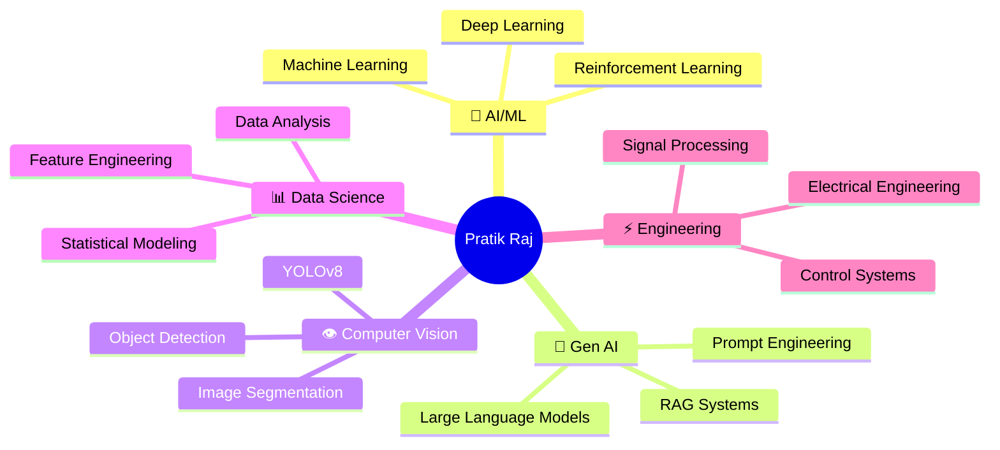

<!-- ═══════════════════════════════════════════════════════════════════════════════════ -->
<!-- 🌟 PRATIK RAJ — GitHub Profile README | IIT Bhilai | AI/ML Researcher 🌟         -->
<!-- ═══════════════════════════════════════════════════════════════════════════════════ -->

<div align="center">

<!-- Animated Header Banner -->


<!-- Animated Typing SVG -->
<a href="https://github.com/pratikraj12341620">
  
</a>

<!-- Profile Views & Social Badges -->
<br/>
<p>
  
  <a href="https://github.com/pratikraj12341620?tab=followers">
    
  </a>
  <a href="https://github.com/pratikraj12341620?tab=repositories">
    
  </a>
</p>

<!-- Animated Line -->


</div>

<!-- ─────────────────────────── ABOUT ME ─────────────────────────── -->

##  &nbsp;About Me


```yaml
Name: Pratik Raj
Institute: Indian Institute of Technology (IIT) Bhilai
Degree: B.Tech in Electrical Engineering (4th Year)
Domains: AI | ML | Deep Learning | Generative AI | Computer Vision
Location: India 🇮🇳
Current Focus: Generative AI & Advanced Deep Learning
Fun Fact: I can debug neural networks faster than I can debug my sleep schedule 😄
```

<br/>

> *"The only way to do great work is to love what you do — and I love building intelligent systems that change the world."*

<br clear="right"/>

<!-- Animated Line -->


<!-- ─────────────────────────── ACHIEVEMENTS ─────────────────────────── -->

## 🏆 Achievements & Milestones

<div align="center">

<table>
  <tr>
    <td align="center" width="50%">
      <br/>
      
      <br/><br/>
      <b>🎖️ Chanakya Fellowship Awardee</b><br/>
      <sub>Prestigious national fellowship awarded during <b>3rd Year of B.Tech</b></sub><br/>
      <sub>Domain: <b>Artificial Intelligence & Machine Learning</b></sub><br/>
      <sub>Recognizing exceptional research potential & academic excellence</sub>
      <br/><br/>
    </td>
    <td align="center" width="50%">
      <br/>
      
      <br/><br/>
      <b>⭐ Best Intern Award — TCS</b><br/>
      <sub>Awarded <b>Best Intern</b> among all interns in the project</sub><br/>
      <sub>Domain: <b>AI/ML Engineering</b></sub><br/>
      <sub>Outstanding contribution to cutting-edge AI solutions</sub>
      <br/><br/>
    </td>
  </tr>
</table>

</div>

<!-- Animated Line -->


<!-- ─────────────────────────── EXPERIENCE ─────────────────────────── -->

## 💼 Professional Experience

<details open>
<summary><b>🔬 Click to explore my journey</b></summary>
<br/>

<!-- Timeline Style Experience -->

> ### 🛡️ **Defence Research & Development Organisation (DRDO)**
> 
>
> 🔹 Interned at India's premier defense research organization during **2nd year of B.Tech**  
> 🔹 Contributed to critical research projects serving national defense  
> 🔹 Gained exposure to cutting-edge defense technology and systems  
> 🔹 Early internship showcasing strong foundational skills and initiative

---

> ### 💎 **Tata Consultancy Services (TCS)**
> 
>
> 🔹 Worked on **AI/ML domain** projects at one of the world's largest IT companies  
> 🔹 **🏆 Awarded Best Intern** among all interns in the project  
> 🔹 Developed and deployed machine learning models for real-world applications  
> 🔹 Recognized for exceptional technical skills and impactful contributions

---

> ### 🚀 **Vishwena Techno Solutions** *(Startup)*
> 
>
> 🔹 Gained valuable startup ecosystem experience  
> 🔹 Worked in a fast-paced, innovation-driven environment  
> 🔹 Contributed to building tech solutions from the ground up  
> 🔹 Developed entrepreneurial mindset and agile problem-solving skills

</details>

<!-- Animated Line -->


<!-- ─────────────────────────── TECH STACK ─────────────────────────── -->

## 🛠️ Tech Stack & Skills

<div align="center">

### 🧠 AI / ML / Deep Learning
<p>
  
  
  
  
  
  
</p>

### 🐍 Programming Languages
<p>
  
  
  
  
</p>

### 📚 Frameworks & Libraries
<p>
  
  
  
  
  
  
  
  
  
  
</p>

### 🔧 Tools & Platforms
<p>
  
  
  
  
  
  
  
</p>

</div>

<!-- Animated Line -->


<!-- ─────────────────────────── SKILL BARS ─────────────────────────── -->

## 📊 Expertise Levels

```text
Machine Learning       ████████████████████████░░   95%
Deep Learning          ███████████████████████░░░   90%
Generative AI          ██████████████████████░░░░   85%
Computer Vision        ██████████████████████░░░░   85%
Python                 ████████████████████████░░   95%
C Programming          ████████████████████░░░░░░   80%
Data Analysis          ██████████████████████░░░░   88%
NLP                    ████████████████████░░░░░░   80%
Model Deployment       ██████████████████░░░░░░░░   75%
Research & Innovation  ████████████████████████░░   93%
```

<!-- Animated Line -->


<!-- ─────────────────────────── GITHUB STATS ─────────────────────────── -->

## 📈 GitHub Analytics

<div align="center">

<!-- Stats Cards Row -->
<p>
  <a href="https://github.com/pratikraj12341620">
    
  </a>
  <a href="https://github.com/pratikraj12341620">
    
  </a>
</p>

<!-- Streak Stats -->
<p>
  <a href="https://github.com/pratikraj12341620">
    
  </a>
</p>

<!-- Activity Graph -->
<a href="https://github.com/pratikraj12341620">
  
</a>

</div>

<!-- Animated Line -->


<!-- ─────────────────────────── EDUCATION ─────────────────────────── -->

## 🎓 Education

<div align="center">

<table>
  <tr>
    <td align="center">
      <br/>
      
      <br/><br/>
      <h3>🏛️ Indian Institute of Technology, Bhilai</h3>
      <b>Bachelor of Technology — Electrical Engineering</b><br/>
      <sub>📅 4th Year (Expected Graduation: 2027)</sub><br/><br/>
      
      
      
      <br/><br/>
    </td>
  </tr>
</table>

</div>

<!-- Animated Line -->


<!-- ─────────────────────────── DOMAINS ─────────────────────────── -->

## 🌐 Domains of Expertise

<div align="center">



</div>

<!-- Animated Line -->


<!-- ─────────────────────────── TROPHIES ─────────────────────────── -->

## 🏅 GitHub Trophies

<div align="center">
  
</div>

<!-- Animated Line -->


<!-- ─────────────────────────── JOURNEY TIMELINE ─────────────────────────── -->

## 🗺️ My Journey So Far

```
╔══════════════════════════════════════════════════════════════════════════╗
║                                                                          ║
║   🎓 1st Year ──► Foundations in Electrical Engineering @ IIT Bhilai     ║
║        │          Discovered passion for AI & ML                         ║
║        ▼                                                                 ║
║   🛡️ 2nd Year ──► Internship @ DRDO                                     ║
║        │          Defense Research & Development Organisation            ║
║        ▼                                                                 ║
║   🏅 3rd Year ──► 🏆 Chanakya Fellowship (AI/ML Domain)                 ║
║        │          National Recognition for Research Excellence           ║
║        ▼                                                                 ║
║   💎 4th Year ──► TCS Internship (Best Intern Award 🏆)                 ║
║        │          Vishwena Techno Solutions (Startup Experience)         ║
║        ▼                                                                 ║
║   🚀 Present ──► Building the Future with AI & Gen AI                   ║
║                   Open to Research & Industry Collaborations             ║
║                                                                          ║
╚══════════════════════════════════════════════════════════════════════════╝
```

<!-- Animated Line -->


<!-- ─────────────────────────── QUOTE ─────────────────────────── -->

<div align="center">
  
### 💡 Random Dev Quote
<br/>

[](https://github.com/piyushsuthar/github-readme-quotes)

</div>

<!-- Animated Line -->


<!-- ─────────────────────────── CONNECT WITH ME ─────────────────────────── -->

## 🤝 Let's Connect!

<div align="center">
  <p>
    <a href="https://github.com/pratikraj12341620">
      
    </a>
    <a href="https://www.linkedin.com/in/pratikraj12341620/">
      
    </a>
    <a href="mailto:pratikraj@iitbhilai.ac.in">
      
    </a>
  </p>
  
  <br/>
  
  
  
  
</div>

<br/>

<!-- Animated Line -->


<!-- ─────────────────────────── SNAKE ANIMATION ─────────────────────────── -->

<div align="center">
  <picture>
    <source media="(prefers-color-scheme: dark)" srcset="https://raw.githubusercontent.com/pratikraj12341620/pratikraj12341620/output/github-snake-dark.svg" />
    <source media="(prefers-color-scheme: light)" srcset="https://raw.githubusercontent.com/pratikraj12341620/pratikraj12341620/output/github-snake.svg" />
    
  </picture>
</div>

<!-- ─────────────────────────── CONTRIBUTION 3D ─────────────────────────── -->

<div align="center">
  
</div>

<br/>

<div align="center">
  
  
  
</div>

<!-- ─────────────────────────── FOOTER ─────────────────────────── -->

<br/>

<div align="center">

### ⚡ *"From Electrical Circuits to Neural Networks — Engineering Intelligence, One Model at a Time"* ⚡

<br/>


</div>

<!-- ═══════════════════════════════════════════════════════════════════════════════════ -->
<!-- 💜 Made with passion by Pratik Raj | IIT Bhilai | pratikraj12341620               -->
<!-- ═══════════════════════════════════════════════════════════════════════════════════ -->
